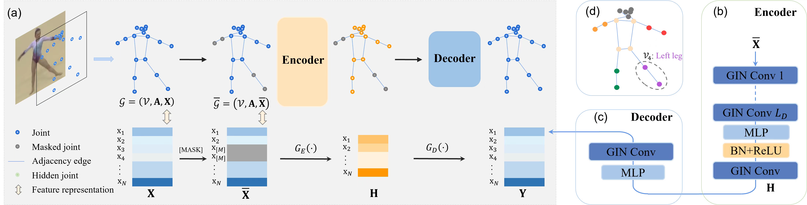

# SkeletonMAE
SkeletonMAE: Graph-based Masked Autoencoder for Skeleton Sequence Pre-training

[ICCV 2023] [SkeletonMAE: Graph-based Masked Autoencoder for Skeleton Sequence Pre-training](https://arxiv.org/pdf/2307.08476.pdf)

### Abstract

Skeleton sequence representation learning has shown great advantages for action recognition due to its promising ability to model human joints and topology. However, the current methods usually require sufficient labeled data for training computationally expensive models, which is labor-intensive and time-consuming. Moreover, these methods ignore how to utilize the fine-grained dependencies among different skeleton joints to pre-train an efficient skeleton sequence learning model that can generalize well across different datasets. In this paper, we propose an efficient skeleton sequence learning framework, named Skeleton Sequence Learning (SSL). To comprehensively capture the human pose and obtain discriminative skeleton sequence representation, we build an asymmetric graph-based encoder-decoder pre-training architecture named SkeletonMAE, which embeds skeleton joint sequence into Graph Convolutional Network (GCN) and reconstructs the masked skeleton joints and edges based on the prior human topology knowledge. Then, the pre-trained SkeletonMAE encoder is integrated with the Spatial-Temporal Representation Learning (STRL) module to build the SSL framework. Extensive experimental results show that our SSL generalizes well across different datasets and outperforms the state-of-the-art self-supervised skeleton-based action recognition methods on FineGym, Diving48, NTU 60 and NTU 120 datasets. Additionally, we obtain comparable performance to some fully supervised methods. 

### Model



Framework of our proposed skeleton.
### Code
Project code will be released in the near future...

### Citation
Cite as below if you find this repository is helpful to your project:

```
@inproceedings{yan2023skeletonmae,
    title={SkeletonMAE: Graph-based Masked Autoencoder for Skeleton Sequence Pre-training},
    author={Yan, Hong and Liu, Yang and Wei, Yushen and  Li, Guanbin and Lin, Liang},
    booktitle={Proceedings of the IEEE/CVF International Conference on Computer Vision},
    year={2023}
}

```

If you have any problem, no hesitate contact us at yanh36@mail2.sysu.edu.cn
